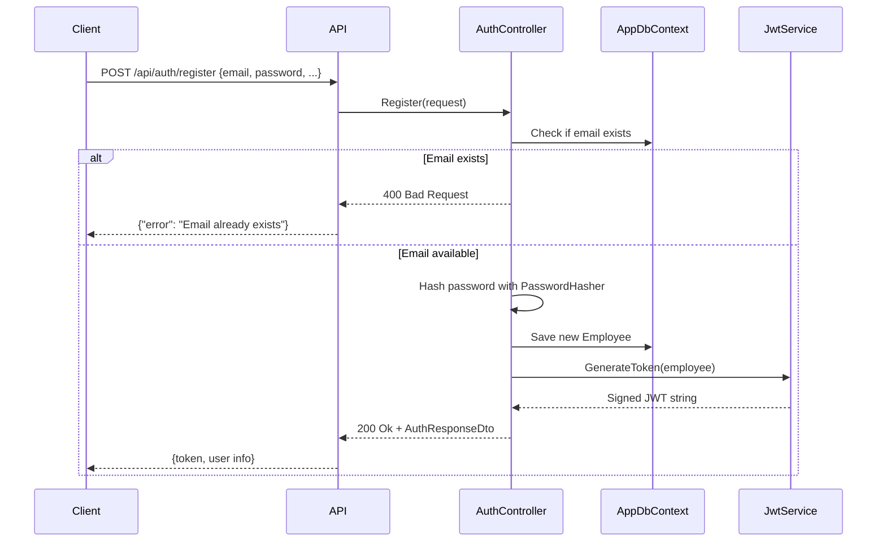
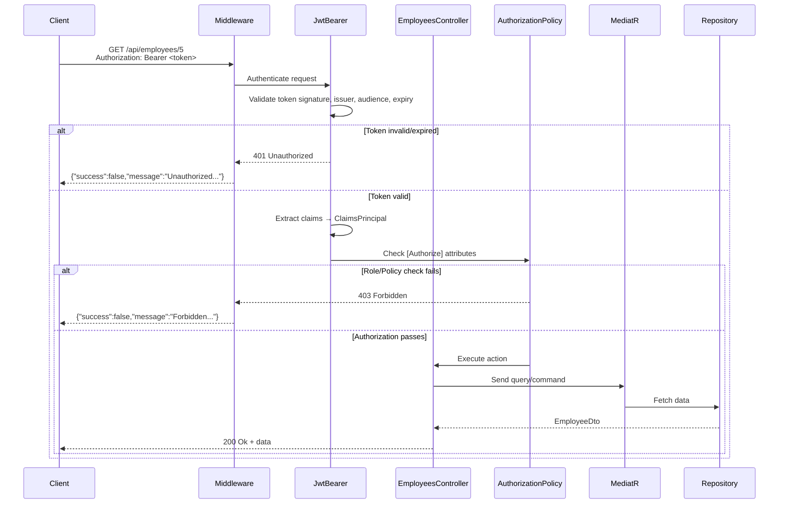

# 🔐 Authentication & Authorization in .NET Employee Management
## Comprehensive Learning Notes

> *"Secure by design, simple by implementation"*

---

## 📋 Table of Contents
1. [Overview: AuthN vs AuthZ](#overview)
2. [Architecture & File Responsibilities](#architecture)
3. [Request Flow & Lifecycle](#request-flow)
4. [JWT Token Deep Dive](#jwt-deep-dive)
5. [Authorization Mechanisms](#authorization)
6. [Security Best Practices](#security)
7. [Real-World Considerations](#real-world)
8. [Visual Aids](#visual-aids)
9. [Memory Hooks](#memory-hooks)

---

## 1. Overview: Authentication vs Authorization <a name="overview"></a>

### 🔑 Authentication (AuthN) - "Who are you?"
```csharp
// In AuthController.Login()
var employee = await _context.Employees.FirstOrDefaultAsync(e => e.Email == request.Email);
var result = passwordHasher.VerifyHashedPassword(employee, employee.PasswordHash, request.Password);
```
- **Purpose**: Verify user identity via credentials (email + password)
- **Output**: JWT token containing user claims
- **Real-world analogy**: Showing your employee badge at the front desk

### 🔐 Authorization (AuthZ) - "What can you do?"
```csharp
// In EmployeesController
[Authorize(Roles = "Admin")]
[Authorize(Policy = "CanDeleteEmployee")]
[HttpDelete("{id}")]
public async Task<IActionResult> Delete(int id) { ... }
```
- **Purpose**: Check if authenticated user has permission for an action
- **Mechanisms**: Roles, Claims, Policies
- **Real-world analogy**: Your badge only opens doors to departments you work in

### Why Both Are Critical in Employee Management:
| Scenario | AuthN Only | AuthN + AuthZ |
|----------|-----------|---------------|
| Intern views salary data | ❌ Possible | ✅ Blocked by policy |
| HR deletes employee record | ❌ Anyone logged in | ✅ Only HR Admins |
| API called with stolen token | ❌ Full access | ✅ Token expiry + claims validation |

---

## 2. Architecture & File Responsibilities <a name="architecture"></a>

### 🗂️ Project Structure Overview
```
EmployeeManagement/
├── API/
│   ├── Controllers/
│   │   ├── AuthController.cs          # 🔑 AuthN entry point
│   │   └── EmployeesController.cs     # 🔐 AuthZ protected endpoints
│   ├── Middleware/
│   │   ├── ExceptionMiddleware.cs     # 🚨 Global error handling
│   │   ├── RequestLoggingMiddleware.cs # 📊 Performance logging
│   │   └── LoggingConfiguration.cs    # 📝 Serilog setup
│   └── Program.cs                     # 🚀 App startup & pipeline
├── Application/
│   ├── Common/Interfaces/
│   │   ├── IWriteAppDbContext.cs      # ✍️ CQRS Write side
│   │   ├── IEmployeeReadRepository.cs # 👁️ CQRS Read side
│   │   └── IExceptionLogger.cs        # 🗄️ Exception persistence
│   └── Employees/
│       ├── Commands/                  # MediatR commands (CUD operations)
│       └── Queries/                   # MediatR queries (R operations)
├── Domain/
│   └── Entities/Employee.cs           # 📦 Core business entity
└── Infrastructure/
    ├── Persistence/
    │   ├── AppDbContext.cs            # 🗄️ EF Core context + indexes
    │   └── EmployeeReadRepository.cs  # 🔍 Optimized read queries
    ├── Services/Jwt/
    │   ├── IJwtService.cs             # 🎫 Token generation contract
    │   ├── JwtService.cs              # 🎫 Token generation implementation
    │   └── JwtOptions.cs              # ⚙️ JWT configuration POCO
    ├── DependencyInjection.cs         # 🔧 Service registration
    └── SeedData.cs                    # 🌱 Default admin seeding
```

### 🔍 Class-by-Class Breakdown

#### **AuthController.cs**
| Aspect | Details |
|--------|---------|
| **Responsibility** | Handle user registration & login; issue JWT tokens |
| **Key Interactions** | `AppDbContext` (read/write employees), `IJwtService` (token generation), `PasswordHasher<T>` (security) |
| **Why This Design** | Separates auth concerns from business logic; uses ASP.NET Core's built-in password hashing |
| **Alternatives** | ASP.NET Core Identity (more features, more complexity), IdentityServer4/OpenIddict (OAuth2/OIDC for SSO) |

```csharp
// Key pattern: Password hashing with ASP.NET Core's built-in hasher
var passwordHasher = new PasswordHasher<Employee>();
employee.SetPassword(passwordHasher.HashPassword(employee, request.Password));
```

#### **EmployeesController.cs**
| Aspect | Details |
|--------|---------|
| **Responsibility** | Expose employee CRUD endpoints with granular authorization |
| **Key Interactions** | `IMediator` (CQRS pattern), `[Authorize]` attributes, policies |
| **Why This Design** | Attribute-based authorization is declarative and testable; MediatR separates concerns |
| **Authorization Stack** | `[Authorize(Roles="Admin")]` + `[Authorize(Policy="CanDeleteEmployee")]` = **AND** logic |

```csharp
// Policy composition: Role + Claim requirement
services.AddAuthorizationBuilder()
    .AddPolicy("CanDeleteEmployee", policy => 
        policy.RequireAssertion(context => 
            context.User.IsInRole("Admin") && 
            context.User.HasClaim("Department", "HR")));
```

#### **JwtService.cs & JwtOptions.cs**
| Aspect | Details |
|--------|---------|
| **Responsibility** | Generate signed JWT tokens with user claims |
| **Key Interactions** | `JwtOptions` (configuration), `SecurityAlgorithms.HmacSha256` (signing) |
| **Why This Design** | Options pattern for config; symmetric key for simplicity (asymmetric for production) |
| **Claims Included** | `sub` (user ID), `email`, `role`, `department`, `jti` (unique token ID) |

```csharp
// Token generation flow
var claims = new List<Claim> {
    new(JwtRegisteredClaimNames.Sub, employee.Id.ToString()), // Subject
    new(ClaimTypes.Role, employee.Role),                       // Role for [Authorize(Roles=...)]
    new("Department", employee.Department),                    // Custom claim for policies
    new(JwtRegisteredClaimNames.Jti, Guid.NewGuid().ToString()) // Prevent replay attacks
};
```

#### **AppDbContext.cs & Repository Interfaces**
| Aspect | Details |
|--------|---------|
| **Responsibility** | Data persistence with CQRS separation (write vs read) |
| **Key Interactions** | EF Core for ORM, indexes for performance, `AsNoTracking()` for reads |
| **Why This Design** | CQRS optimizes read/write paths; interfaces enable testing & swapping implementations |
| **Performance Features** | Composite indexes, keyset pagination, `AsNoTracking()` for query efficiency |

```csharp
// Optimized read query with projection
public async Task<EmployeeDto?> GetByIdAsync(int id, CancellationToken cancellationToken) {
    return await _context.Employees
        .AsNoTracking() // 🚀 Skip change tracking for reads
        .Where(e => e.Id == id)
        .Select(e => new EmployeeDto(...)) // 🎯 Project only needed fields
        .FirstOrDefaultAsync(cancellationToken);
}
```

#### **Middleware Stack (ExceptionMiddleware, RequestLoggingMiddleware)**
| Aspect | Details |
|--------|---------|
| **Responsibility** | Cross-cutting concerns: error handling, logging, performance monitoring |
| **Key Interactions** | `HttpContext`, `ILogger`, `IExceptionLogger`, `Stopwatch` |
| **Why This Design** | Middleware pipeline is ASP.NET Core's native way to handle cross-cutting concerns |
| **Order Matters** | `UseAuthentication()` → `UseAuthorization()` → custom middleware |

```csharp
// Exception handling with structured logging
catch (ValidationException ex) {
    _logger.LogError($"Validation error: {ex.Message}");
    httpContext.Response.StatusCode = (int)HttpStatusCode.BadRequest;
    await exceptionLogger.LogAsync(ex, ...); // Persist to database
    await httpContext.Response.WriteAsJsonAsync(new { 
        Success = false, 
        Message = "Validation error",
        Errors = ex.Errors.Select(e => new { e.PropertyName, e.ErrorMessage })
    });
}
```

#### **DependencyInjection.cs**
| Aspect | Details |
|--------|---------|
| **Responsibility** | Configure services: DI, JWT auth, authorization policies, database |
| **Key Interactions** | `IServiceCollection`, `IConfiguration`, `JwtBearerOptions` |
| **Why This Design** | Centralized configuration; options pattern for type-safe config |
| **Critical Settings** | `ClockSkew = TimeSpan.Zero` (prevent token reuse), `ValidateLifetime = true` |

```csharp
// JWT validation - defense in depth
options.TokenValidationParameters = new TokenValidationParameters {
    ValidateIssuer = true,
    ValidateAudience = true,
    ValidateLifetime = true,
    ClockSkew = TimeSpan.Zero, // ⚠️ No grace period for expiry
    ValidateIssuerSigningKey = true,
    // ... key configuration
};
```

#### **SeedData.cs**
| Aspect | Details |
|--------|---------|
| **Responsibility** | Initialize database with default admin account |
| **Key Interactions** | `PasswordHasher<T>`, `AppDbContext` |
| **Why This Design** | Ensures system has at least one admin; idempotent (checks before seeding) |
| **Security Note** | Default credentials should be changed in production! |

---

## 3. Request Flow & Lifecycle <a name="request-flow"></a>

### 🔐 Login/Register Flow


### 🔑 Token Validation Flow (Every Protected Request)


### 🔄 Employee CRUD Flow with Authorization
```csharp
// Client request: DELETE /api/employees/42
// Headers: Authorization: Bearer <jwt_token_with_claims>

// 1. Middleware pipeline processes request
app.UseAuthentication();    // ✅ Validates JWT → Creates ClaimsPrincipal
app.UseAuthorization();     // ✅ Checks [Authorize] attributes

// 2. Controller authorization attributes evaluated
[Authorize(Roles = "Admin")]                    // ❓ Is user in "Admin" role?
[Authorize(Policy = "CanDeleteEmployee")]       // ❓ Does user meet policy requirements?

// 3. Policy evaluation (from DependencyInjection.cs)
policy.RequireAssertion(context => 
    context.User.IsInRole("Admin") &&           // ✅ Role check
    context.User.HasClaim("Department", "HR")); // ✅ Claim check

// 4. If all checks pass → Execute action
await _mediator.Send(new DeleteEmployeeCommand(id));
```

---

## 4. JWT Token Deep Dive <a name="jwt-deep-dive"></a>

### 🧩 Token Structure (Decoded Example)
```json
{
  "header": {
    "alg": "HS256",
    "typ": "JWT"
  },
  "payload": {
    "sub": "123",                    // Subject: Employee ID
    "email": "admin@example.com",    // Email claim
    "role": "Admin",                 // Role claim (for [Authorize(Roles=...)])
    "Department": "HR",             // Custom claim (for policy assertions)
    "jti": "a1b2c3d4-...",          // Unique token ID (prevent replay)
    "iss": "EmployeeManagementAPI", // Issuer
    "aud": "EmployeeManagementClient", // Audience
    "iat": 1709000000,              // Issued at (Unix timestamp)
    "exp": 1709003600               // Expiry: 60 minutes from issue
  },
  "signature": "HMACSHA256(base64Url(header)+base64Url(payload), secret_key)"
}
```

### 🔑 Claims Breakdown & Purpose
| Claim | Type | Purpose | Used By |
|-------|------|---------|---------|
| `sub` | Standard | Unique user identifier | User context, audit logs |
| `email` | Standard | User's email address | Display, notifications |
| `role` | Standard (ClaimTypes.Role) | Role-based authorization | `[Authorize(Roles="Admin")]` |
| `Department` | Custom | Department-based authorization | Policy assertions |
| `jti` | Standard | Token uniqueness | Replay attack prevention |
| `exp` | Standard | Token expiration | Automatic invalidation |
| `iss`/`aud` | Standard | Token scope validation | Prevent token misuse across apps |

### ⚙️ Token Generation Details
```csharp
// From JwtService.cs
var key = new SymmetricSecurityKey(Encoding.UTF8.GetBytes(_options.Key));
var creds = new SigningCredentials(key, SecurityAlgorithms.HmacSha256);

var token = new JwtSecurityToken(
    issuer: _options.Issuer,
    audience: _options.Audience,
    claims: claims,
    expires: DateTime.UtcNow.AddMinutes(expiryMinutes), // Configurable expiry
    signingCredentials: creds
);
```

**Security Considerations:**
- ✅ **Symmetric key (HMAC)**: Simple for single-service apps
- ⚠️ **Production**: Use asymmetric keys (RSA/ECDSA) for microservices
- ✅ **Short expiry (60 min)**: Limits damage from token theft
- ✅ **JTI claim**: Enables token revocation lists (if implemented)

### 🔐 How Roles & Claims Control Authorization
```csharp
// Scenario: Can user delete employee #42?

// Token contains:
// - role: "Admin"
// - Department: "HR"

// Policy definition:
.AddPolicy("CanDeleteEmployee", policy => 
    policy.RequireAssertion(context => 
        context.User.IsInRole("Admin") &&      // ✅ Role check passes
        context.User.HasClaim("Department", "HR"))); // ✅ Claim check passes

// Result: Authorization succeeds ✅

// If token had Department: "Finance":
// Role check ✅, Claim check ❌ → 403 Forbidden
```

---

## 5. Authorization Mechanisms <a name="authorization"></a>

### 🎯 Three Layers of Authorization

#### Layer 1: `[Authorize]` Attribute (Baseline)
```csharp
[Authorize] // Any authenticated user
[HttpGet("{id}")]
public async Task<IActionResult> GetById(int id) { ... }
```
- **Effect**: Requires valid JWT token
- **Use case**: Endpoints where any logged-in employee can access

#### Layer 2: Role-Based Authorization
```csharp
[Authorize(Roles = "Admin")] // Only users with role="Admin"
[HttpPost]
public async Task<IActionResult> Create([FromBody] CreateEmployeeCommand command) { ... }
```
- **How it works**: Checks `ClaimTypes.Role` claim in token
- **Limitation**: Roles are coarse-grained (all Admins have same permissions)

#### Layer 3: Policy-Based Authorization (Most Flexible)
```csharp
// Policy definition in DependencyInjection.cs
.AddPolicy("CanDeleteEmployee", policy => 
    policy.RequireAssertion(context => 
        context.User.IsInRole("Admin") && 
        context.User.HasClaim("Department", "HR")));

// Usage in controller
[Authorize(Policy = "CanDeleteEmployee")]
[HttpDelete("{id}")]
public async Task<IActionResult> Delete(int id) { ... }
```

### 🔄 Roles vs Claims vs Policies: Key Differences

| Concept | What It Is | Storage Location | Flexibility | Best For |
|---------|-----------|------------------|-------------|----------|
| **Role** | Group of permissions | `ClaimTypes.Role` claim | Low (all-or-nothing) | Coarse access control (Admin/User) |
| **Claim** | Key-value pair about user | JWT payload, custom claim types | Medium (queryable) | User attributes (Department, Location) |
| **Policy** | Business rule combining roles/claims | Code definition in DI | High (complex logic) | Fine-grained, dynamic permissions |

### 🧪 Policy Types in Your App

#### 1. `AdminOnly` Policy
```csharp
.AddPolicy("AdminOnly", policy => policy.RequireRole("Admin"))
```
- **Purpose**: Simple role check (shorthand for `[Authorize(Roles="Admin")]`)
- **Usage**: `[Authorize(Policy = "AdminOnly")]` on `/api/employees/admins`

#### 2. `CanDeleteEmployee` Policy
```csharp
.AddPolicy("CanDeleteEmployee", policy => 
    policy.RequireAssertion(context => 
        context.User.IsInRole("Admin") && 
        context.User.HasClaim("Department", "HR")));
```
- **Purpose**: Composite rule requiring both role AND department claim
- **Usage**: Protects DELETE, PUT, PATCH operations
- **Why Assertion?**: Allows complex logic beyond built-in requirements

### 🔍 Authorization Evaluation Order
1. `[Authorize]` → Is token valid and not expired?
2. `[Authorize(Roles=...)]` → Does user have required role claim?
3. `[Authorize(Policy=...)]` → Does user satisfy policy assertion?
4. **All must pass** → Request proceeds to controller action

---

## 6. Security Best Practices <a name="security"></a>

### 🔒 Password Handling
```csharp
// ✅ CORRECT: Use ASP.NET Core's PasswordHasher
var passwordHasher = new PasswordHasher<Employee>();
employee.SetPassword(passwordHasher.HashPassword(employee, request.Password));

// ✅ Verification
var result = passwordHasher.VerifyHashedPassword(
    employee, 
    employee.PasswordHash, 
    request.Password);
if (result == PasswordVerificationResult.Failed) 
    return Unauthorized("Invalid credentials");
```

**Why PasswordHasher?**
- ✅ Uses PBKDF2 with random salt (mitigates rainbow table attacks)
- ✅ Built-in password upgrade mechanism
- ✅ Constant-time comparison (prevents timing attacks)
- ❌ Never store plain-text passwords or use simple hashes (MD5, SHA1)

### 🔐 Token Security Measures
| Practice | Implementation in Your Code | Why It Matters |
|----------|----------------------------|---------------|
| **Short expiry** | `ExpiryMinutes = "60"` in JwtOptions | Limits window for token misuse |
| **Validate all fields** | `ValidateIssuer`, `ValidateAudience`, `ValidateLifetime` | Prevents token forgery/replay |
| **Zero clock skew** | `ClockSkew = TimeSpan.Zero` | No grace period for expired tokens |
| **HTTPS only** | `app.UseHttpsRedirection()` | Prevents token interception |
| **JTI claim** | `new JwtRegisteredClaimNames.Jti, Guid.NewGuid()` | Enables token revocation (if implemented) |

### 🚨 Error Handling: Unauthorized vs Forbidden
```csharp
// In DependencyInjection.cs - JwtBearer Events
OnChallenge = async context => {
    context.HandleResponse();
    context.Response.StatusCode = 401; // 🔑 Authentication failed
    await context.Response.WriteAsJsonAsync(new { 
        success = false, 
        message = "Unauthorized - Invalid or missing token" 
    });
},
OnForbidden = async context => {
    context.Response.StatusCode = 403; // 🔐 Authorization failed
    await context.Response.WriteAsJsonAsync(new { 
        success = false, 
        message = "Forbidden - You are not authorized" 
    });
};
```

**Key Distinction:**
- `401 Unauthorized`: "We don't know who you are" (missing/invalid token)
- `403 Forbidden`: "We know who you are, but you can't do that" (insufficient permissions)

### 🛡️ Additional Security Layers
```csharp
// 1. Rate limiting (not shown in code but recommended)
// 2. Input validation (FluentValidation in middleware)
catch (ValidationException ex) {
    httpContext.Response.StatusCode = (int)HttpStatusCode.BadRequest;
    // Return structured validation errors
}

// 3. SQL injection prevention (EF Core parameterization)
// ✅ Safe: _context.Employees.Where(e => e.Email == email)
// ❌ Dangerous: Raw SQL with string concatenation

// 4. Logging sensitive data (AVOID)
_logger.LogInformation("User {UserId} logged in", employee.Id); // ✅
_logger.LogInformation("Password: {Password}", password); // ❌ NEVER
```

---

## 7. Real-World Considerations <a name="real-world"></a>

### 🌐 Scaling Authentication Across Multiple Apps
**Current Approach**: Single JWT for Employee Management API
**Scaling Options**:

| Approach | Pros | Cons | When to Use |
|----------|------|------|-------------|
| **Shared JWT** | Simple, no extra infrastructure | All apps trust same key; hard to revoke per-app | Internal microservices |
| **OAuth2/OIDC** (IdentityServer, Duende, Auth0) | Standardized, token introspection, SSO | More complex setup, external dependency | Multiple client apps, external partners |
| **API Gateway** (YARP, Ocelot) | Centralized auth, rate limiting, routing | Additional hop, complexity | Large-scale systems |

**Recommendation for Growth**:
```csharp
// Future-proof your JwtOptions for OIDC
public class JwtOptions {
    public string Key { get; set; } // For symmetric (dev)
    public string? JwksUri { get; set; } // For asymmetric (prod OIDC)
    // ...
}

// In DI, conditionally configure:
if (!string.IsNullOrEmpty(jwtOptions.JwksUri)) {
    // Use JwtBearer with OpenIdConnectProtocolValidator
    // Fetch signing keys from JWKS endpoint
}
```

### 🔄 Token Revocation Strategies
**Problem**: JWTs are stateless → can't invalidate before expiry
**Solutions**:

1. **Short Expiry + Refresh Tokens** (Recommended)
```csharp
// Add to AuthResponseDto
public record AuthResponseDto(
    int UserId, 
    string Token,        // Access token (60 min)
    string RefreshToken, // Long-lived token (7 days)
    // ...
);

// Refresh endpoint: validate refresh token → issue new access token
// Store refresh tokens in database with expiration + revocation flag
```

2. **Token Denylist (JTI-based)**
```csharp
// On logout, add token's JTI to cache/database
// In JwtBearer events, check if JTI is denied:
options.Events.OnTokenValidated = async context => {
    var jti = context.Principal.FindFirst(JwtRegisteredClaimNames.Jti)?.Value;
    if (await _tokenDenylist.IsDeniedAsync(jti)) {
        context.Fail("Token has been revoked");
    }
};
```

3. **Sliding Expiration** (Less secure, simpler)
```csharp
// Extend token expiry on each use (not recommended for high-security)
// Risk: Stolen token stays valid longer
```

### 📊 Logging & Exception Management
**Your Current Strengths**:
- ✅ Structured logging with Serilog (enriched context)
- ✅ Global exception middleware (consistent error responses)
- ✅ Database logging via `IExceptionLogger` (audit trail)

**Enhancements for Production**:
```csharp
// 1. Correlation IDs for request tracing
app.Use(async (context, next) => {
    var correlationId = Guid.NewGuid().ToString();
    context.Items["CorrelationId"] = correlationId;
    LogContext.PushProperty("CorrelationId", correlationId);
    await next();
});

// 2. Sensitive data redaction in logs
logger.LogInformation("Login attempt for email: {Email}", 
    LogMasker.MaskEmail(request.Email)); // "a***@example.com"

// 3. Alerting on critical errors
if (ex is SecurityTokenExpiredException) {
    _alertService.SendAlert("Token validation failure spike detected");
}
```

---

## 8. Visual Aids <a name="visual-aids"></a>

### 🗺️ Request Flow Diagram (ASCII)
```
┌─────────────────┐
│   Client App    │
└────────┬────────┘
         │ HTTP Request + Bearer Token
         ▼
┌─────────────────┐
│  Middleware     │
│  Pipeline:      │
│  • Exception    │
│  • HTTPS Redirect│
│  • Routing      │
│  • Authentication│ ← Validates JWT signature/expiry
│  • Authorization │ ← Checks [Authorize] attributes
│  • Request Logging│
└────────┬────────┘
         │ If authorized:
         ▼
┌─────────────────┐
│  Controller     │
│  • AuthController: Register/Login
│  • EmployeesController: CRUD operations
│  • Uses MediatR for CQRS
└────────┬────────┘
         │
         ▼
┌─────────────────┐
│  Application    │
│  • Commands/Queries
│  • Validation (FluentValidation)
│  • Business Logic
└────────┬────────┘
         │
         ▼
┌─────────────────┐
│  Infrastructure │
│  • AppDbContext (Write)
│  • EmployeeReadRepository (Read)
│  • JwtService
└────────┬────────┘
         │
         ▼
┌─────────────────┐
│  Database       │
│  • SQL Server   │
│  • Indexed queries│
│  • Keyset pagination│
└─────────────────┘
```

### 📋 Authorization Rules Summary Table

| Endpoint | HTTP Method | AuthN Required | Role Required | Policy Required | Effective Permissions |
|----------|-------------|----------------|---------------|-----------------|----------------------|
| `/api/auth/register` | POST | ❌ No | ❌ None | ❌ None | Public registration |
| `/api/auth/login` | POST | ❌ No | ❌ None | ❌ None | Public login |
| `/api/employees` | GET | ✅ Yes | ❌ None | ❌ None | Any authenticated employee |
| `/api/employees/{id}` | GET | ✅ Yes | ❌ None | ❌ None | Any authenticated employee |
| `/api/employees` | POST | ✅ Yes | ✅ Admin | ❌ None | Admins only |
| `/api/employees/{id}` | PUT/PATCH/DELETE | ✅ Yes | ✅ Admin | ✅ CanDeleteEmployee | Admins in HR department |
| `/api/employees/admins` | GET | ✅ Yes | ❌ None | ✅ AdminOnly | Admins only (policy shorthand) |

### 🔑 JWT Claim Usage Matrix

| Claim Name | Added In | Used By Authorization | Example Value |
|------------|----------|----------------------|---------------|
| `sub` | JwtService | Audit logging, user context | `"123"` |
| `email` | JwtService | Display, notifications | `"admin@example.com"` |
| `role` | JwtService | `[Authorize(Roles="Admin")]` | `"Admin"` |
| `Department` | JwtService | Policy assertions | `"HR"` |
| `jti` | JwtService | Token revocation (future) | `"a1b2c3d4-..."` |
| `exp` | JwtService | Automatic expiration | `1709003600` |

---

## 9. Memory Hooks <a name="memory-hooks"></a>

### 🧠 "Tattoo These in Your Brain"

#### 🔑 Core Concepts
1. **"AuthN first, AuthZ second"**: Always authenticate before authorizing. No token → 401. Bad permissions → 403.
2. **"Claims are the currency of authorization"**: Roles are just a special type of claim. Policies combine claims for fine-grained control.
3. **"Short-lived tokens + refresh = security + UX"**: 60-minute access tokens limit damage; refresh tokens maintain session.

#### 💻 Implementation Patterns
4. **"PasswordHasher<T> is your friend"**: Never roll your own crypto. ASP.NET Core's hasher handles salting, stretching, and timing attacks.
5. **"CQRS separates concerns"**: `IWriteAppDbContext` for commands, `IEmployeeReadRepository` for queries → optimize each path independently.
6. **"Middleware order is critical"**: `UseAuthentication()` must come before `UseAuthorization()`, which must come before your controllers.

#### 🛡️ Security Mantras
7. **"Validate everything, trust nothing"**: Even with JWTs, validate issuer, audience, expiry, and signature on every request.
8. **"Log without leaking"**: Include correlation IDs and user IDs in logs, but NEVER log passwords, tokens, or PII.
9. **"Fail securely"**: Return generic error messages to clients ("Invalid credentials"), but log detailed errors server-side.

#### 🚀 Real-World Wisdom
10. **"Start simple, scale deliberately"**: Symmetric JWTs are fine for monoliths. Plan for OIDC when you add mobile apps or external partners.
11. **"Policies beat roles for complex rules"**: Instead of creating 10 roles, use 2 roles + claims + policies for flexible permissions.
12. **"Test authorization like business logic"**: Write unit tests for policies: `policy.Requirements.Should().Contain(...)` and integration tests for endpoints.

### 🎯 Quick Reference: Authorization Attribute Cheat Sheet
```csharp
// 🔓 Public endpoint
[AllowAnonymous]
[HttpGet("public")]

// 🔑 Any authenticated user
[Authorize]
[HttpGet("profile")]

// 👔 Role-based (coarse)
[Authorize(Roles = "Admin,Manager")]
[HttpPost("approve")]

// 🎯 Policy-based (fine-grained)
[Authorize(Policy = "CanEditSalary")]
[HttpPut("salary/{id}")]

// 🔗 Combine: Role AND Policy (AND logic)
[Authorize(Roles = "Admin")]
[Authorize(Policy = "FromHQ")]
[HttpDelete("sensitive/{id}")]

// ⚠️ Common mistake: OR logic requires custom policy
// This does NOT work as OR:
[Authorize(Roles = "Admin")]
[Authorize(Roles = "Manager")] // ❌ Both required!
// ✅ Instead, create policy: policy.RequireRole("Admin", "Manager")
```

### 🔄 Debugging Authorization Issues
```bash
# 1. Decode your JWT (use https://jwt.io)
# Check: exp, role, Department claims

# 2. Enable detailed auth logging in appsettings.Development.json
"Logging": {
  "LogLevel": {
    "Microsoft.AspNetCore.Authentication": "Debug",
    "Microsoft.AspNetCore.Authorization": "Debug"
  }
}

# 3. Test with curl:
curl -H "Authorization: Bearer YOUR_TOKEN" https://localhost:5001/api/employees

# 4. Common fixes:
# - 401? → Token expired, invalid signature, or missing Auth header
# - 403? → Token valid but missing role/claim for policy
# - Policy not working? → Check policy name spelling in [Authorize] vs AddPolicy()
```

---

## 🎓 Final Exam Prep: Key Questions & Answers

**Q: Why use both Roles and Claims?**  
A: Roles provide simple group-based access ("Admin"), while claims carry user attributes ("Department=HR"). Policies combine them for complex rules without exploding your role count.

**Q: How does [Authorize] actually work under the hood?**  
A: The `AuthorizationMiddleware` intercepts requests after authentication. It evaluates attributes by checking the `ClaimsPrincipal` in `HttpContext.User` against role claims, policy requirements, or custom assertions.

**Q: What's the difference between OnChallenge and OnForbidden in JwtBearer?**  
A: `OnChallenge` triggers when authentication fails (no token, bad signature) → 401. `OnForbidden` triggers when auth succeeds but authorization fails (insufficient permissions) → 403.

**Q: Why use AsNoTracking() in read repositories?**  
A: EF Core change tracking adds overhead. For read-only queries, `AsNoTracking()` improves performance by 20-50% and reduces memory usage.

**Q: How would you add multi-factor authentication (MFA)?**  
A: After password validation in `Login()`, check if user has MFA enabled. If yes, return 202 Accepted with a temporary token, require MFA code verification endpoint, then issue final JWT.

---

> 💡 **Pro Tip**: When studying, implement one small enhancement at a time:
> 1. Add refresh tokens
> 2. Implement token revocation with JTI
> 3. Add a new policy like "CanViewSalaries" requiring Department=HR OR Role=Admin
> 4. Integrate an external identity provider (Auth0, Azure AD)
>
> Each step reinforces the core concepts while building production-ready skills.

**You now have a complete mental model of auth in your .NET Employee Management app. Go build something secure! 🔐✨**


---

# **1️⃣ Authentication Matrix: When & Which to Use**

| App Type / Environment                | Authentication Method   | Why / Pros                                    | Dev vs Staging vs Prod                                                   | .NET Implementation (Layer)                                                                | Notes                                                                   |
| ------------------------------------- | ----------------------- | --------------------------------------------- | ------------------------------------------------------------------------ | ------------------------------------------------------------------------------------------ | ----------------------------------------------------------------------- |
| Traditional Web App (MVC/Razor Pages) | Cookie-based Session    | Simple, server-side session, browser support  | Dev: HTTP OK, long session; Staging: HTTPS; Prod: HTTPS + secure cookies | Presentation Layer (`UseAuthentication`)                                                   | Use anti-forgery tokens to prevent CSRF                                 |
| SPA (React/Angular) + REST API        | JWT Bearer Token        | Stateless, scalable, microservices friendly   | Dev: self-signed certs OK; Prod: HTTPS, short-lived tokens               | Application: `ITokenService` Interface; Infrastructure: `JwtTokenService`; API: middleware | Store in memory / secure storage, avoid localStorage for sensitive apps |
| Enterprise Apps / Multi-App           | OAuth2 + OpenID Connect | Central identity, SSO, no password management | Dev: test identity provider; Staging/Prod: real IDP (Azure AD, Okta)     | API/Infrastructure: configure `AddOpenIdConnect` and policies                              | Ideal for enterprise + multi-tenancy                                    |
| Service-to-Service / Microservices    | API Key or mTLS         | Lightweight, machine identity, stateless      | Dev: local secrets; Staging/Prod: Vault / Key rotation                   | Infrastructure: validate keys or certs in middleware                                       | Use HTTPS always; rotate keys; log failed auth                          |
| High-Security / Banking               | Certificate + 2FA       | Strong auth                                   | Dev: dev certs; Prod: real certs + MFA                                   | Infrastructure + API: mTLS validation middleware                                           | Requires PKI management; rotate certs                                   |

---

# **2️⃣ Authorization Matrix: When & Which to Use**

| Authorization Type      | Use Case                        | Pros                     | Cons                                 | Clean Architecture Layer                                                     | Recommendation                          |
| ----------------------- | ------------------------------- | ------------------------ | ------------------------------------ | ---------------------------------------------------------------------------- | --------------------------------------- |
| Role-Based (RBAC)       | Small apps / few roles          | Simple, easy             | Not flexible for fine-grained access | Application: policies or simple attributes                                   | Only for small apps                     |
| Policy-Based / Claims   | Medium/Large apps               | Flexible, fine-grained   | Slightly more complex                | Application: `AuthorizationBehavior<T>`; Presentation: `[Authorize(Policy)]` | Recommended default                     |
| Resource-Based          | Multi-tenant or per-user access | Granular, precise        | Adds per-resource checks             | Application Layer or Handler                                                 | Use for per-user / per-tenant resources |
| ABAC / Permission-Based | Enterprise SaaS                 | Dynamic, highly granular | Complex                              | Application Layer + policies                                                 | Recommended for enterprise SaaS         |

---

# **3️⃣ Example: JWT Auth + Policy-Based Authorization in Clean Architecture**

### **Application Layer**

```csharp
// Define interface
public interface ITokenService
{
    string GenerateToken(UserDto user);
}
```

```csharp
// MediatR pipeline for authorization
public class AuthorizationBehavior<TRequest, TResponse> : IPipelineBehavior<TRequest, TResponse>
{
    private readonly IHttpContextAccessor _httpContext;

    public AuthorizationBehavior(IHttpContextAccessor httpContext)
    {
        _httpContext = httpContext;
    }

    public async Task<TResponse> Handle(
        TRequest request,
        RequestHandlerDelegate<TResponse> next,
        CancellationToken cancellationToken)
    {
        var user = _httpContext.HttpContext?.User;

        if (user == null || !user.Identity.IsAuthenticated)
            throw new UnauthorizedAccessException("User not authenticated");

        // Example: check a claim
        if (!user.HasClaim("permission", "CanDeleteEmployee") && request is DeleteEmployeeCommand)
            throw new UnauthorizedAccessException("User cannot delete employee");

        return await next();
    }
}
```

---

### **Infrastructure Layer**

```csharp
public class JwtTokenService : ITokenService
{
    private readonly JwtSettings _settings;

    public JwtTokenService(IOptions<JwtSettings> settings)
    {
        _settings = settings.Value;
    }

    public string GenerateToken(UserDto user)
    {
        var claims = new List<Claim>
        {
            new Claim(JwtRegisteredClaimNames.Sub, user.Id.ToString()),
            new Claim(ClaimTypes.Email, user.Email),
            new Claim("role", user.Role),
            new Claim("permission", "CanDeleteEmployee") // Example
        };

        var key = new SymmetricSecurityKey(Encoding.UTF8.GetBytes(_settings.Key));
        var creds = new SigningCredentials(key, SecurityAlgorithms.HmacSha256);

        var token = new JwtSecurityToken(
            issuer: _settings.Issuer,
            audience: _settings.Audience,
            claims: claims,
            expires: DateTime.UtcNow.AddMinutes(30),
            signingCredentials: creds
        );

        return new JwtSecurityTokenHandler().WriteToken(token);
    }
}
```

---

### **Presentation Layer (API)**

```csharp
builder.Services.AddAuthentication(JwtBearerDefaults.AuthenticationScheme)
    .AddJwtBearer(options =>
    {
        options.TokenValidationParameters = new TokenValidationParameters
        {
            ValidateIssuer = true,
            ValidateAudience = true,
            ValidateLifetime = true,
            ValidateIssuerSigningKey = true,
            ValidIssuer = configuration["Jwt:Issuer"],
            ValidAudience = configuration["Jwt:Audience"],
            IssuerSigningKey = new SymmetricSecurityKey(
                Encoding.UTF8.GetBytes(configuration["Jwt:Key"]))
        };
    });

builder.Services.AddAuthorization(options =>
{
    options.AddPolicy("CanDeleteEmployee", policy =>
        policy.RequireClaim("permission", "CanDeleteEmployee"));
});
```

---

### **Controller Example**

```csharp
[Authorize(Policy = "CanDeleteEmployee")]
[HttpDelete("{id}")]
public async Task<IActionResult> DeleteEmployee(int id)
{
    await _mediator.Send(new DeleteEmployeeCommand(id));
    return NoContent();
}
```

---

# **4️⃣ Dev / Staging / Production Differences in .NET**

| Aspect            | Dev             | Staging      | Prod                            |
| ----------------- | --------------- | ------------ | ------------------------------- |
| HTTPS             | Optional        | Recommended  | Mandatory                       |
| Token Lifetime    | Long            | Medium       | Short                           |
| Secret Management | appsettings     | Secret store | Key Vault / Secrets Manager     |
| Logging           | Verbose console | Structured   | Centralized (Serilog + Seq/ELK) |
| CORS              | Open            | Restricted   | Locked to frontend domains      |

---

# ✅ **Senior Recommendations**

* **JWT + Policy-based authorization** is default for APIs and microservices.
* **Cookie + RBAC** only for server-rendered apps.
* Use **Claims + Policies** for enterprise-grade fine-grained control.
* Always centralize authorization checks in **MediatR pipeline or custom middleware**.
* Log auth events, but **never log passwords or full tokens**.
* Use **refresh tokens** for long sessions in SPAs.
* Use **HTTPS + Key Vault** for prod secrets.

---

# **1️⃣ Blueprint: Auth Flow + Clean Architecture**

```
+------------------+          +------------------+          +------------------+
|     Client       |          |   API Gateway /  |          |    Backend API   |
| (Browser / SPA / |  HTTPS   |  Load Balancer   |          | (Presentation)  |
|  Mobile App)     +--------->|                  +--------->|                  |
+------------------+          +------------------+          +--------+---------+
                                                                    |
                                                                    v
                                                         +------------------+
                                                         | Middleware Layer |
                                                         |                  |
                                                         | - UseAuthentication() (JWT / Cookie / OAuth2) 
                                                         | - UseAuthorization() (Policies / Claims)
                                                         +------------------+
                                                                    |
                                                                    v
                                                         +------------------+
                                                         | Application Layer|
                                                         |                  |
                                                         | - MediatR CQRS Pipeline
                                                         |   - AuthorizationBehavior<T>
                                                         | - Application Interfaces (ITokenService)
                                                         +------------------+
                                                                    |
                                                                    v
                                                         +------------------+
                                                         | Infrastructure   |
                                                         |                  |
                                                         | - JwtTokenService / Identity Server
                                                         | - Password Hashing / Cert Validation
                                                         | - External Auth Provider (OAuth2 / OpenID Connect)
                                                         +------------------+
                                                                    |
                                                                    v
                                                         +------------------+
                                                         | Domain Layer     |
                                                         |                  |
                                                         | - User Entity
                                                         | - Role / Permission / Tenant Claims
                                                         +------------------+
```

---

# **2️⃣ Recommended Auth Type per App + Environment**

| App Type                       | Dev                   | Staging                | Prod                                     | Recommended Auth        | Recommended Authorization     |
| ------------------------------ | --------------------- | ---------------------- | ---------------------------------------- | ----------------------- | ----------------------------- |
| Traditional MVC Web App        | HTTP, verbose logging | HTTPS                  | HTTPS, Secure cookies                    | Cookie Session          | RBAC or Policy                |
| SPA (React/Angular) + REST API | JWT, self-signed      | JWT, HTTPS             | JWT, HTTPS, short expiry + refresh token | JWT Bearer              | Policy-Based (claims)         |
| Enterprise / Multi-App         | Test OAuth2           | OAuth2 + staging IDP   | OAuth2 + Production IDP                  | OAuth2 / OpenID Connect | Policy-Based + ABAC           |
| Service-to-Service             | API key / dev cert    | API key / staging cert | API key / prod cert                      | API Key / mTLS          | Claims-Based / Resource-Based |
| High-Security / Banking        | Dev certs, test 2FA   | Staging certs + MFA    | Production certs + MFA                   | Certificate + 2FA       | Claims + Resource-Based       |

---

# **3️⃣ Key Senior Considerations**

1. **JWT Tokens**

   * Short-lived for security, refresh tokens for long sessions
   * Claims store roles, tenant IDs, permissions

2. **Policy-Based Authorization**

   * Use in CQRS pipeline to centralize
   * Avoid spreading `[Authorize]` everywhere

3. **Environment Differences**

   * Secrets: Dev → appsettings, Staging → secret store, Prod → Key Vault
   * HTTPS mandatory for Staging & Prod
   * Logging: Verbose Dev → Centralized Structured Prod

4. **Clean Architecture Placement**

| Concern                        | Layer              |
| ------------------------------ | ------------------ |
| Token generation / hashing     | Infrastructure     |
| Auth policies / pipeline       | Application        |
| Middleware / AddAuthentication | Presentation / API |
| User entity / roles            | Domain             |

---

# **4️⃣ Real-World Flow Example (SPA + REST API)**

1. User logs in → API calls `LoginCommand`
2. `Application Layer` verifies user → calls `ITokenService`
3. `Infrastructure Layer` generates JWT → returns to client
4. Client stores token (memory / HttpOnly cookie)
5. Each request → API middleware validates JWT
6. ClaimsPrincipal built → `AuthorizationBehavior<T>` checks permissions
7. If authorized → MediatR handler executes → database / domain layer

---

# **5️⃣ Dev / Staging / Prod Differences (Quick Reference)**

| Aspect         | Dev             | Staging         | Prod                                      |
| -------------- | --------------- | --------------- | ----------------------------------------- |
| HTTPS          | Optional        | Recommended     | Mandatory                                 |
| Token lifetime | Long            | Medium          | Short                                     |
| Secret storage | appsettings     | Secret manager  | Azure Key Vault / AWS Secrets Manager     |
| Logging        | Console verbose | Structured file | Centralized logging (Serilog + Seq / ELK) |
| CORS           | Open            | Limited         | Locked to frontend domains                |

---
