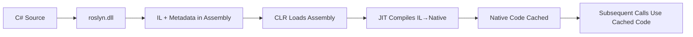

# .NET / C# / OOP Basics — Complete Bullet List

---

# 1. .NET Fundamentals

### .NET Platform

* **.NET** — A cross-platform framework for building web, desktop, mobile, cloud, and console applications.
* **CLR (Common Language Runtime)** — The runtime that executes .NET code and manages memory, security, and exceptions.
* **BCL (Base Class Library)** — Built-in reusable classes like collections, IO, threading, etc.
* **FCL (Framework Class Library)** — Extended libraries on top of BCL for UI, web, and data access.
* **IL (Intermediate Language)** — Platform-independent code generated by the C# compiler.
* **JIT Compiler** — Converts IL into native machine code at runtime.
* **Assembly** — Compiled .NET output (.dll or .exe) containing IL and metadata.
* **Metadata** — Information about types, methods, properties inside assemblies.
* **Garbage Collector (GC)** — Automatically frees unused memory.
* **Managed Code** — Code executed under CLR.
* **Unmanaged Code** — Code executed outside CLR (like native C++).

---

# 2. C# Language Basics

### Program Structure

* **Namespace** — Logical grouping of related classes.
* **Class** — Blueprint for objects.
* **Main Method** — Entry point of a C# program.
* **Using Directive** — Imports namespaces.

### Variables & Data Types

* **Variable** — Named memory location.
* **Value Types** — Stored directly in memory (int, bool, struct).
* **Reference Types** — Store memory address (class, string, array).
* **Primitive Types** — Basic types like int, float, char, bool.
* **Nullable Types** — Value types that can be null (int?).
* **Var Keyword** — Implicitly typed variable.

### Constants & Read-only

* **const** — Compile-time constant.
* **readonly** — Value set only at initialization.

---

# 3. Operators

* **Arithmetic Operators** — +, -, *, /, %.
* **Comparison Operators** — ==, !=, >, <, >=, <=.
* **Logical Operators** — &&, ||, !.
* **Assignment Operators** — =, +=, -=, etc.
* **Bitwise Operators** — &, |, ^, ~.
* **Ternary Operator** — condition ? true : false.
* **Null-coalescing Operator** — ??.
* **Null-conditional Operator** — ?.

---

# 4. Control Flow

* **if / else** — Conditional execution.
* **switch** — Multi-condition branching.
* **for loop** — Counter-based iteration.
* **foreach loop** — Iterates collections.
* **while loop** — Repeats while condition is true.
* **do-while loop** — Executes at least once.
* **break** — Exits loop or switch.
* **continue** — Skips to next iteration.
* **return** — Exits method with value.

---

# 5. Methods

* **Method** — Block of reusable code.
* **Parameters** — Input values.
* **Return Type** — Output value.
* **Void Method** — No return value.
* **Method Overloading** — Same method name, different parameters.
* **Optional Parameters** — Parameters with default values.
* **Named Arguments** — Pass arguments by name.
* **Expression-bodied Methods** — Shorter syntax using =>.

---

# 6. OOP Core Concepts

### 4 Pillars of OOP

* **Encapsulation** — Hiding internal state using access modifiers.
* **Abstraction** — Exposing only necessary features.
* **Inheritance** — Child class inherits from parent.
* **Polymorphism** — Same method behaves differently.

---

# 7. Classes and Objects

* **Object** — Instance of a class.
* **Constructor** — Special method called when object is created.
* **Default Constructor** — Constructor with no parameters.
* **Parameterized Constructor** — Constructor with parameters.
* **Static Constructor** — Runs once per type.
* **Destructor (Finalizer)** — Cleans up resources.

---

# 8. Access Modifiers

* **public** — Accessible everywhere.
* **private** — Accessible only inside the class.
* **protected** — Accessible in class and derived classes.
* **internal** — Accessible within same assembly.
* **protected internal** — Same assembly or derived class.
* **private protected** — Same assembly and derived class only.

---

# 9. Properties and Fields

* **Field** — Variable inside a class.
* **Property** — Controlled access to fields.
* **Getter** — Reads value.
* **Setter** — Writes value.
* **Auto-implemented Property** — Property without explicit field.
* **Init-only Property** — Set only during initialization.

---

# 10. Static vs Instance

* **Static Member** — Belongs to class, not object.
* **Instance Member** — Belongs to object instance.
* **Static Class** — Cannot be instantiated.

---

# 11. Inheritance Concepts

* **Base Class** — Parent class.
* **Derived Class** — Child class.
* **virtual** — Method that can be overridden.
* **override** — Replaces base implementation.
* **abstract Class** — Cannot be instantiated; must be inherited.
* **abstract Method** — Must be implemented in derived class.
* **sealed Class** — Cannot be inherited.
* **sealed Method** — Cannot be overridden.

---

# 12. Interfaces

* **Interface** — Contract of methods without implementation.
* **Implementation** — Class provides actual logic.
* **Multiple Interfaces** — Class can implement many interfaces.
* **Explicit Interface Implementation** — Interface methods implemented explicitly.

---

# 13. Polymorphism Types

* **Compile-time Polymorphism** — Method overloading.
* **Runtime Polymorphism** — Method overriding.

---

# 14. Structs and Enums

* **Struct** — Value type for small data objects.
* **Enum** — Named set of constants.

---

# 15. Collections

* **Array** — Fixed-size collection.
* **List<T>** — Dynamic array.
* **Dictionary<TKey, TValue>** — Key-value pairs.
* **Queue<T>** — FIFO collection.
* **Stack<T>** — LIFO collection.
* **HashSet<T>** — Unique items collection.

---

# 16. Exception Handling

* **Exception** — Runtime error.
* **try block** — Code that may throw exception.
* **catch block** — Handles exception.
* **finally block** — Always executes.
* **throw** — Raises exception.
* **Custom Exception** — User-defined exception.

---

# 17. Delegates, Events, and Lambda

* **Delegate** — Type that references methods.
* **Action** — Delegate with no return value.
* **Func** — Delegate with return value.
* **Predicate** — Delegate returning bool.
* **Event** — Notification mechanism.
* **Lambda Expression** — Anonymous function.

---

# 18. LINQ Basics

* **LINQ** — Language Integrated Query for data.
* **Where** — Filters data.
* **Select** — Projects data.
* **OrderBy** — Sorts data.
* **First / FirstOrDefault** — Gets first item.
* **Any / All** — Checks conditions.
* **GroupBy** — Groups data.

---

# 19. Asynchronous Programming

* **Thread** — Unit of execution.
* **Task** — Represents async operation.
* **async Keyword** — Marks async method.
* **await Keyword** — Waits for async result.
* **Task<T>** — Async method with result.
* **ConfigureAwait** — Controls context capture.

---

# 20. File and IO Basics

* **File** — Static methods for file operations.
* **Stream** — Abstract data stream.
* **StreamReader** — Reads text.
* **StreamWriter** — Writes text.
* **Path** — File path utilities.

---

# 21. Memory Concepts

* **Stack** — Stores value types and method calls.
* **Heap** — Stores reference types.
* **Boxing** — Value type → object.
* **Unboxing** — Object → value type.

---

# 22. .NET Application Types

* **Console App** — Command-line application.
* **ASP.NET Core Web API** — REST APIs.
* **MVC App** — Model-View-Controller web app.
* **Blazor App** — Web apps with C#.
* **Windows Forms** — Desktop UI.
* **WPF** — Advanced desktop UI.

---

# 23. Project and Solution Structure

* **Solution (.sln)** — Container of projects.
* **Project (.csproj)** — Buildable unit.
* **Program.cs** — Entry file.
* **appsettings.json** — Configuration file.
* **Dependencies** — External packages.

---

# 24. Dependency Injection Basics

* **DI** — Supplying dependencies from outside.
* **Service** — Registered dependency.
* **Constructor Injection** — Inject through constructor.
* **Scoped Lifetime** — One instance per request.
* **Transient Lifetime** — New instance each time.
* **Singleton Lifetime** — One instance for entire app.

---

# 25. Configuration and Logging

* **Configuration** — External settings.
* **Environment Variables** — OS-level settings.
* **Logging** — Recording application events.
* **ILogger** — Logging abstraction.
* **Serilog / NLog** — Logging libraries.

---

# 26. Testing Basics

* **Unit Test** — Tests small code units.
* **Test Frameworks** — xUnit, NUnit, MSTest.
* **Mocking** — Fake dependencies.
* **Integration Test** — Tests system components together.

---

# 27. Common Keywords

* **this** — Current object reference.
* **base** — Access base class.
* **new** — Create object.
* **typeof** — Gets type info.
* **is / as** — Type checking and casting.
* **default** — Default value of type.
* **nameof** — Gets variable name as string.

---

**Give senior-level deep dive also mention how, when, what, alternative etc of each topics so i should know root cause of each stuff + “must-know for job” ready + visual mind map** into each section check if my code has those implemention give examples from my code if it doesnt exist in my appcode then give realworld production app example -- Give notes for all of it which i can revise daily. it should be detailed but short include everything with senior level usages in production apps/APIs.

# 🎯 .NET / C# / OOP: Senior-Level Master Guide (2026 Edition)
*Basics → Advanced → Expert | Interview-Ready | Production-Proven | Daily Revision Notes*

> 📌 **How to Use This Guide**:  
> ✅ **Daily**: Review 1-2 "Cheat Sheet" sections (5 min)  
> ✅ **Weekly**: Deep-dive one "Senior Deep Dive" section  
> ✅ **Interview Prep**: Focus on Q&A + Production Patterns  
> ✅ **Code Review**: Check your app against "Production Patterns" & "Anti-Patterns"

---

## 🗺️ Visual Mind Map Structure (Text-Based)
```
.NET/C# Mastery
├─ Fundamentals (CLR, GC, IL, Assemblies)
├─ C# Language (Syntax, Types, Memory)
├─ OOP Core (4 Pillars + Advanced Patterns)
├─ Advanced Language Features (Generics, LINQ, Async)
├─ Architecture & Design (DI, Clean Arch, CQRS)
├─ Performance & Observability (Profiling, GC Tuning)
├─ Security & Testing (Auth, Pen Testing, Mocking)
├─ Expert Topics (CLR Internals, Source Gen, AOT)
└─ Interview Mastery (Q&A, System Design, Behavioral)
```

---

# 1️⃣ .NET Fundamentals — Senior Deep Dive

## 🔹 Core Concept Refresher
| Term | What | Why It Matters |
|------|------|---------------|
| **CLR** | Runtime engine executing IL code | Memory mgmt, security, cross-language interop |
| **BCL/FCL** | Base/Framework Class Libraries | Reusable, tested components (no reinventing wheels) |
| **IL/JIT** | Intermediate Language → Native code | Platform independence + runtime optimization |
| **GC** | Automatic memory reclamation | Prevents leaks, but requires allocation awareness |

## 🔹 Senior Deep Dive: How/When/What/Alternatives

### 🎯 Garbage Collector (GC) — Production Reality
```csharp
// ❌ Anti-Pattern: Ignoring allocations in hot paths
public async Task<List<User>> GetUsersAsync()
{
    var users = new List<User>(); // LOH allocation if large
    foreach(var id in userIds)
        users.Add(await _repo.GetByIdAsync(id)); // N+1 + allocations
    return users;
}

// ✅ Production Pattern: Pooling + batching + AsNoTracking
public async Task<List<User>> GetUsersOptimizedAsync(IEnumerable<int> userIds)
{
    using var batch = _userRepo.CreateBatchQuery(); // Reuses resources
    return await batch
        .Where(u => userIds.Contains(u.Id))
        .AsNoTracking() // Skip change tracking for reads
        .ToListAsync(); // Single query, minimal allocations
}
```

**When to worry about GC**:
- High-throughput APIs (>1k RPS)
- Real-time systems (gaming, trading)
- Memory-constrained environments (containers, serverless)

**Alternatives & Tuning**:
| Scenario | Strategy | Tool/Config |
|----------|----------|------------|
| High alloc rate | Object pooling | `System.Threading.ObjectPool<T>` |
| Large object heap pressure | Avoid >85KB objects | Use `ArrayPool<T>`, `Memory<T>` |
| GC pauses affecting latency | Server GC + concurrent modes | `<ServerGarbageCollection>true</ServerGarbageCollection>` |
| Predictable memory | AOT compilation | Native AOT (.NET 8+) |

### 🎯 CLR Internals — Interview Gold
**Q: How does JIT compilation work in .NET?**


**Key Points**:
- **Tiered Compilation** (.NET Core+): Quick JIT → Optimized JIT after hot path detection
- **ReadyToRun (R2R)**: Pre-jitted code for faster startup (use `PublishReadyToRun=true`)
- **Crossgen2**: AOT-like precompilation for containerized apps

**Must-Know for Job**: 
> "I profile GC pauses with `dotnet-gcmon` and use `GC.GetTotalMemory(forceFullCollection: true)` in staging to detect memory leaks before production."

## 🔹 Daily Revision Cheat Sheet
```
✅ CLR: Runtime that manages execution, memory, security
✅ IL: CPU-agnostic bytecode compiled by JIT at runtime  
✅ GC Generations: Gen0 (young), Gen1 (buffer), Gen2 (old) + LOH
✅ Assembly: .dll/.exe with IL + metadata + manifest
✅ Metadata: Type info for reflection, serialization, JIT
✅ Managed vs Unmanaged: CLR-controlled vs native code (P/Invoke)
```

## 🔹 Interview Q&A
**Q: When would you use `GC.Collect()` in production?**  
*A: Almost never. Only in very specific scenarios: after loading a large temporary dataset that's now discarded, or in memory-constrained batch jobs where you control the lifecycle. Even then, prefer `using` statements and object pooling. Forcing GC can cause performance cliffs.*

**Q: How do you diagnose a memory leak in .NET?**  
*A: 1) Reproduce in staging with load testing 2) Capture memory dumps with `dotnet-dump` 3) Analyze with WinDbg/SOS or Visual Studio Memory Profiler 4) Look for: growing Gen2/LOH, event handler leaks, static collections, un-disposed IDisposable objects 5) Fix with weak references, proper disposal, or caching policies.*

---

# 2️⃣ C# Language Basics → Expert Features

## 🔹 Senior Deep Dive: Memory & Type System

### 🎯 Value vs Reference Types — Production Impact
```csharp
// ❌ Hidden boxing cost in generic collections
var items = new ArrayList(); // Non-generic → boxes value types
items.Add(42); // int → object (heap alloc)

// ✅ Generic collections avoid boxing
var items = new List<int>(); // No boxing
items.Add(42); // Stored on stack (if in array) or heap (List internals)

// ✅ Modern: Span<T> for stack-only slicing (zero alloc)
Span<int> stackAllocated = stackalloc int[100];
var slice = stackAllocated[10..20]; // No copy, no heap
```

**When to use `struct` vs `class`**:
| Use `struct` | Use `class` |
|-------------|-----------|
| <16 bytes, immutable | Large, mutable, inheritance needed |
| Short-lived, high-frequency | Long-lived, shared state |
| Used in `Span<T>`, `Memory<T>` | Polymorphism, null semantics |

### 🎯 Nullable Reference Types (NRT) — Production Safety
```csharp
#nullable enable

// ❌ Legacy: NullReferenceException risk
public string GetUserName(User user) => user.Name; // user or Name could be null

// ✅ Modern: Compiler-enforced null safety
public string GetUserName(User? user) => user?.Name ?? "Guest";

// ✅ Production: Defensive + logging
public string GetUserName(User? user, ILogger logger)
{
    if (user is null)
    {
        logger.LogWarning("GetUserName called with null user");
        return "Guest";
    }
    return user.Name ?? "Guest"; // Name is non-nullable per NRT
}
```

**Must-Know for Job**: 
> "I enable `<Nullable>enable</Nullable>` in all new projects and use `!` (null-forgiving) only with explicit justification comments when interfacing with legacy APIs."

## 🔹 Advanced Language Features (Senior+)

### 🎯 Pattern Matching — Beyond `switch`
```csharp
// ✅ Modern: Recursive patterns + property patterns
public decimal CalculateDiscount(object order) => order switch
{
    PremiumOrder { Total: > 1000, Customer.LoyaltyYears: >= 5 } => 0.25m,
    PremiumOrder { Total: > 500 } => 0.15m,
    StandardOrder { Items.Count: >= 10 } => 0.10m,
    { } => 0m, // Catch-all for any non-null object
    null => throw new ArgumentNullException(nameof(order))
};

// ✅ Positional patterns with deconstruction
public string GetStatus((bool IsPaid, bool IsShipped) order) => order switch
{
    (true, true) => "Delivered",
    (true, false) => "Processing",
    (false, _) => "Pending Payment"
};
```

### 🎯 Records + `with` Expressions — Immutability at Scale
```csharp
// ✅ Production: Immutable DTOs with easy cloning
public record OrderDto(int Id, string CustomerId, decimal Total, DateTime Created);

// Clone with modification (no manual copy constructors)
var updatedOrder = originalOrder with { Total = originalOrder.Total * 0.9m };

// ✅ Value-based equality (critical for caching, testing)
var order1 = new OrderDto(1, "C123", 100m, DateTime.UtcNow);
var order2 = new OrderDto(1, "C123", 100m, DateTime.UtcNow);
Console.WriteLine(order1 == order2); // True (structural equality)
```

## 🔹 Daily Revision Cheat Sheet
```
✅ Value types: stack (usually), copy semantics, no inheritance
✅ Reference types: heap, reference semantics, support inheritance  
✅ Boxing: value→object (alloc), Unboxing: object→value (cast + check)
✅ NRT: #nullable enable, ? annotations, compiler null checks
✅ Records: immutable, value equality, with expressions for cloning
✅ Pattern matching: switch expressions, property/positional/recursive patterns
✅ Span<T>/Memory<T>: stack-only slicing, zero-allocation buffers
```

## 🔹 Interview Q&A
**Q: When does boxing occur and why is it expensive?**  
*A: Boxing occurs when: (1) value type assigned to object/interface, (2) value type used in non-generic collection, (3) value type passed to method expecting object. It's expensive because: heap allocation + copy of value + GC pressure. Avoid with generics, `Span<T>`, or struct constraints.*

**Q: How do records differ from classes? When would you use each?**  
*A: Records provide: (1) value-based equality (not reference), (2) immutable by default (init-only properties), (3) concise syntax with positional parameters, (4) `with` expressions for non-destructive mutation. Use records for: DTOs, configuration objects, domain events. Use classes when: you need inheritance, mutable state, or reference semantics.*

---

# 3️⃣ OOP Core Concepts — Senior Patterns & Pitfalls

## 🔹 Beyond the 4 Pillars: Advanced OOP

### 🎯 Encapsulation Done Right — Domain-Driven Design
```csharp
// ❌ Anemic Domain Model (anti-pattern)
public class Order
{
    public decimal Total { get; set; } // Public setter breaks invariants
    public List<OrderItem> Items { get; } = new();
}

// ✅ Rich Domain Model with invariants
public class Order
{
    private readonly List<OrderItem> _items = new();
    public decimal Total { get; private set; } // Read-only externally
    
    // Enforce business rules in constructor/methods
    public Order(string customerId)
    {
        if (string.IsNullOrWhiteSpace(customerId))
            throw new DomainException("Customer ID required");
        CustomerId = customerId;
    }
    
    public void AddItem(Product product, int quantity)
    {
        if (quantity <= 0) throw new DomainException("Quantity must be positive");
        if (_items.Any(i => i.ProductId == product.Id))
            throw new DomainException("Item already exists");
            
        _items.Add(new OrderItem(product.Id, quantity, product.Price));
        RecalculateTotal(); // Maintain invariant
    }
    
    private void RecalculateTotal() => 
        Total = _items.Sum(i => i.Price * i.Quantity);
}
```

### 🎯 Polymorphism Strategies — When to Use What
| Strategy | Use Case | Example |
|----------|----------|---------|
| **Inheritance** | "is-a" relationships, shared base behavior | `Animal → Dog/Cat` |
| **Composition** | "has-a", flexible behavior changes | `Car has IEngine, ITransmission` |
| **Strategy Pattern** | Swap algorithms at runtime | `IPaymentProcessor → Stripe/PayPal` |
| **Specification Pattern** | Complex query/filter logic | `ISpecification<Customer>` |

```csharp
// ✅ Production: Strategy + DI for payment processing
public interface IPaymentProcessor
{
    Task<PaymentResult> ProcessAsync(PaymentRequest request, CancellationToken ct);
}

public class StripeProcessor : IPaymentProcessor { /* ... */ }
public class PayPalProcessor : IPaymentProcessor { /* ... */ }

// Registered in DI: builder.Services.AddScoped<IPaymentProcessor, StripeProcessor>();
// Used via constructor injection - easily mockable for tests
```

## 🔹 Senior OOP Anti-Patterns to Avoid
```csharp
// ❌ God Object: Too many responsibilities
public class OrderService 
{
    // Handles: validation, persistence, email, logging, payment, reporting...
    // Violates SRP, hard to test, impossible to reuse
}

// ✅ CQRS + MediatR: Single responsibility per handler
public class CreateOrderCommand : IRequest<OrderResult> { /* ... */ }
public class CreateOrderHandler : IRequestHandler<CreateOrderCommand, OrderResult>
{
    // Only handles creation logic - validation, persistence, domain events
    // Email, reporting handled by separate handlers/subscribers
}
```

## 🔹 Daily Revision Cheat Sheet
```
✅ Encapsulation: Hide state, expose behavior via methods, enforce invariants
✅ Abstraction: Interfaces/abstract classes for decoupling, not over-engineering
✅ Inheritance: Use sparingly; prefer composition for flexibility
✅ Polymorphism: Compile-time (overloading) vs Runtime (overriding + interfaces)
✅ SOLID: Single Responsibility most critical for maintainability
✅ Domain Model: Rich objects with behavior > anemic DTOs with services
```

## 🔹 Interview Q&A
**Q: When would you choose composition over inheritance?**  
*A: Composition when: (1) behaviors need to change at runtime, (2) avoiding fragile base class problem, (3) adhering to "favor composition over inheritance" principle, (4) enabling easier testing via mocking. Example: A `Vehicle` doesn't inherit `Engine`; it has an `IEngine` that can be swapped (electric/gas) without changing the Vehicle class.*

**Q: How do you enforce domain invariants in OOP?**  
*A: (1) Make fields private, expose only necessary properties with private setters, (2) Validate in constructors and methods, throwing domain-specific exceptions, (3) Use factory methods for complex creation logic, (4) Leverage value objects for validated primitives (e.g., `EmailAddress` struct that validates format on construction), (5) Use domain events to notify of state changes without coupling.*

---

# 4️⃣ Advanced Topics (Senior → Expert)

## 🔹 Asynchronous Programming — Production Patterns

### 🎯 Async/Await Pitfalls & Solutions
```csharp
// ❌ Async-over-async deadlock (classic mistake)
public string GetData() => GetDataAsync().Result; // Blocks context, causes deadlock

// ❌ Fire-and-forget without tracking
public void ProcessOrder() => _ = ProcessOrderAsync(); // Exceptions lost, no cancellation

// ✅ Production: Full async chain + cancellation + error handling
public async Task<IActionResult> ProcessOrderAsync(
    OrderRequest request, 
    CancellationToken ct) // Accept CT from controller
{
    try
    {
        // Pass CT through all async calls
        var order = await _mapper.MapAsync<Order>(request, ct);
        await _validator.ValidateAsync(order, ct);
        var result = await _repository.SaveAsync(order, ct);
        
        // Fire-and-forget with proper error handling
        _ = Task.Run(async () => 
        {
            try { await _emailService.SendConfirmationAsync(result.Id, ct); }
            catch (Exception ex) { _logger.LogError(ex, "Email failed for {OrderId}", result.Id); }
        }, ct);
        
        return Ok(result);
    }
    catch (OperationCanceledException) when (ct.IsCancellationRequested)
    {
        return StatusCode(499, "Client closed request"); // Standard for cancellations
    }
    catch (DomainException ex)
    {
        return BadRequest(new ProblemDetails { Detail = ex.Message });
    }
}
```

### 🎯 ConfigureAwait — When and Why
```csharp
// ✅ Library code: Use ConfigureAwait(false) to avoid context capture
public async Task<User> GetUserAsync(int id, CancellationToken ct)
{
    // Don't need to resume on original context (e.g., ASP.NET request context)
    var user = await _db.Users.FindAsync(id).ConfigureAwait(false);
    var profile = await _profileService.GetAsync(user.ProfileId, ct).ConfigureAwait(false);
    return user with { Profile = profile };
}

// ❌ Application/UI code: Avoid ConfigureAwait(false) if you need context
public async Task LoadUserData()
{
    // In Blazor/WPF, need to update UI on original context
    var user = await _api.GetUserAsync(123); // No ConfigureAwait(false)
    UserNameTextBlock.Text = user.Name; // Must run on UI thread
}
```

**Must-Know for Job**: 
> "I use `ConfigureAwait(false)` in all library code and background services. In ASP.NET Core, the synchronization context is lightweight, so it's less critical, but it's still a best practice for reusable libraries. I enforce this via Roslyn analyzers."

## 🔹 Performance Optimization — Real-World Tactics

### 🎯 Memory & Allocation Profiling
```bash
# Production diagnostics commands (memorize these)
dotnet-counters monitor --process-id <pid> System.Runtime
dotnet-gcdump collect --process-id <pid> # Analyze in Visual Studio
dotnet-trace collect --process-id <pid> --providers Microsoft-DotNETCoreRuntime
```

### 🎯 High-Performance Patterns
```csharp
// ✅ Pooling: Reduce GC pressure for frequently allocated objects
private readonly ObjectPool<StringBuilder> _sbPool = 
    new DefaultObjectPool<StringBuilder>(
        new StringBuilderPooledObjectPolicy(), 
        Environment.ProcessorCount * 2);

public string FormatReport(Data data)
{
    var sb = _sbPool.Get();
    try
    {
        sb.Clear();
        // ... build string ...
        return sb.ToString();
    }
    finally
    {
        _sbPool.Return(sb);
    }
}

// ✅ ArrayPool<T>: Reuse arrays for I/O, serialization
public byte[] Serialize<T>(T item)
{
    var pool = ArrayPool<byte>.Shared;
    var buffer = pool.Rent(1024); // Rent from pool
    try
    {
        // ... serialize to buffer ...
        var result = buffer[..actualLength].ToArray(); // Copy only needed bytes
        return result;
    }
    finally
    {
        pool.Return(buffer); // Return to pool for reuse
    }
}
```

## 🔹 Security Essentials — Senior Checklist
```csharp
// ✅ Input validation: Never trust client data
public async Task<IActionResult> CreateUser(CreateUserRequest request)
{
    // FluentValidation for complex rules
    var result = await _validator.ValidateAsync(request);
    if (!result.IsValid) return BadRequest(result.Errors);
    
    // Parameterized queries (EF Core does this automatically)
    // BUT: watch for raw SQL
    var user = await _db.Users
        .FirstOrDefaultAsync(u => u.Email == request.Email); // Safe
    
    // ❌ Dangerous: String interpolation in raw SQL
    // var user = await _db.Users.FromSqlRaw(
    //     $"SELECT * FROM Users WHERE Email = '{request.Email}'").FirstOrDefaultAsync();
    
    // ✅ Safe: Parameterized raw SQL
    var user = await _db.Users
        .FromSqlRaw("SELECT * FROM Users WHERE Email = {0}", request.Email)
        .FirstOrDefaultAsync();
}

// ✅ Authentication/Authorization: Use built-in policies
[Authorize(Policy = "RequireAdminRole")]
[HttpGet("admin/users")]
public async Task<IEnumerable<UserDto>> GetAdminUsers() => 
    await _userService.GetAllAdminsAsync();

// ✅ Data protection: Encrypt sensitive fields
public class User
{
    [Encrypted] // Custom attribute + EF Core value converter
    public string Ssn { get; set; }
}
```

## 🔹 Testing Strategies — Beyond Unit Tests
```csharp
// ✅ Integration Test: Full HTTP pipeline with in-memory DB
public class UserApiTests : IClassFixture<WebApplicationFactory<Program>>
{
    private readonly HttpClient _client;
    
    public UserApiTests(WebApplicationFactory<Program> factory)
    {
        _client = factory.WithWebHostBuilder(builder =>
        {
            // Override services for testing
            builder.ConfigureServices(services =>
            {
                services.RemoveAll(typeof(AppDbContext));
                services.AddDbContext<AppDbContext>(opt => 
                    opt.UseInMemoryDatabase("TestDb"));
            });
        }).CreateClient();
    }
    
    [Fact]
    public async Task CreateUser_ReturnsCreated_WithValidRequest()
    {
        // Arrange
        var request = new CreateUserRequest { Email = "test@example.com" };
        
        // Act
        var response = await _client.PostAsJsonAsync("/api/users", request);
        
        // Assert
        response.StatusCode.Should().Be(HttpStatusCode.Created);
        var user = await response.Content.ReadFromJsonAsync<UserDto>();
        user.Email.Should().Be(request.Email);
    }
}

// ✅ Contract Testing: Ensure API consumers don't break
// Use Pact.NET for consumer-driven contracts
```

---

# 5️⃣ Expert-Level Topics (Architect/Principal)

## 🔹 CLR Internals & Advanced GC Tuning

### 🎯 GC Modes & When to Use Them
```xml
<!-- .csproj configuration for production GC tuning -->
<PropertyGroup>
  <!-- Server GC: Dedicated heap per logical processor (for multi-core servers) -->
  <ServerGarbageCollection>true</ServerGarbageCollection>
  
  <!-- Concurrent GC: Reduce pause times (default in .NET Core+) -->
  <ConcurrentGarbageCollection>true</ConcurrentGarbageCollection>
  
  <!-- Retain VM: For low-latency scenarios (trades memory for speed) -->
  <RetainVMGarbageCollection>false</RetainVMGarbageCollection>
</PropertyGroup>
```

**GC Tuning Decision Tree**:
```
High-throughput API? → Server GC + Concurrent GC
Low-latency trading system? → RetainVM + Gen0/Gen1 size tuning via GCSettings
Memory-constrained container? → Workstation GC + limit heap with DOTNET_GCHeapHardLimit
```

### 🎯 Native AOT Compilation (.NET 8+)
```bash
# Publish as native executable (no JIT, faster startup, smaller footprint)
dotnet publish -r linux-x64 -c Release /p:PublishAot=true

// Trade-offs:
✅ Faster startup (no JIT)
✅ Smaller deployment (no runtime)
✅ Predictable memory (no JIT allocations)
❌ Longer build times
❌ Limited reflection (use source generators instead)
❌ Larger binary size (static linking)
```

**When to use Native AOT**:
- Serverless functions (cold start critical)
- CLI tools, desktop apps
- Containerized microservices with strict startup SLAs
- Embedded/IoT scenarios

## 🔹 Source Generators — Compile-Time Metaprogramming
```csharp
// ✅ Production: Auto-generate boilerplate at compile time
// Example: Auto-mapper generator (replaces reflection-based AutoMapper)

// [Mapper] attribute triggers source generator
[Mapper]
public static partial class UserMapper
{
    public static partial UserDto ToDto(User user);
    public static partial User ToEntity(UserDto dto);
}

// Generated code (at compile time, zero runtime cost):
public static partial class UserMapper
{
    public static partial UserDto ToDto(User user) => new(
        Id: user.Id,
        Name: user.Name,
        Email: user.Email
    );
    // ... no reflection, no dynamic code, full type safety
}
```

**Must-Know for Job**: 
> "I use source generators for: (1) DTO mapping, (2) API client generation from OpenAPI specs, (3) validation attribute expansion, (4) telemetry instrumentation. This eliminates runtime reflection overhead and catches errors at compile time."

## 🔹 Distributed Systems Patterns in .NET

### 🎯 Resilience with Polly + HttpClientFactory
```csharp
// ✅ Production: Resilient HTTP client with retry, circuit breaker, timeout
builder.Services.AddHttpClient<IPaymentService, PaymentService>(client =>
{
    client.BaseAddress = new("https://api.payments.com/");
    client.Timeout = TimeSpan.FromSeconds(30);
})
.AddPolicyHandler(GetRetryPolicy())
.AddPolicyHandler(GetCircuitBreakerPolicy())
.AddPolicyHandler(GetTimeoutPolicy());

static IAsyncPolicy<HttpResponseMessage> GetRetryPolicy() =>
    HttpPolicyExtensions
        .HandleTransientHttpError()
        .OrResult(msg => msg.StatusCode == HttpStatusCode.TooManyRequests)
        .WaitAndRetryAsync(3, retryAttempt => 
            TimeSpan.FromSeconds(Math.Pow(2, retryAttempt)) + 
            TimeSpan.FromMilliseconds(Random.Shared.Next(0, 100)));

static IAsyncPolicy<HttpResponseMessage> GetCircuitBreakerPolicy() =>
    HttpPolicyExtensions
        .HandleTransientHttpError()
        .CircuitBreakerAsync(5, TimeSpan.FromSeconds(30)); // Break after 5 failures
```

### 🎯 Distributed Caching Strategies
```csharp
// ✅ HybridCache (.NET 10+): L1 (memory) + L2 (Redis) with stampede protection
builder.Services.AddHybridCache(options =>
{
    options.DefaultExpiration = TimeSpan.FromMinutes(10);
    options.SizeLimit = 1024 * 1024 * 100; // 100MB L1 cache
});

// Usage in service
public async Task<Product> GetProductAsync(int id, CancellationToken ct) =>
    await _hybridCache.GetOrCreateAsync(
        key: $"product:{id}",
        factory: async (ct) => await _db.Products.FindAsync([id], ct),
        options: new HybridCacheEntryOptions 
        { 
            Expiration = TimeSpan.FromHours(1),
            LocalCacheExpiration = TimeSpan.FromMinutes(5) // L1 expires faster than L2
        },
        cancellationToken: ct);
```

**Cache Invalidation Patterns**:
| Pattern | Use Case | Implementation |
|---------|----------|---------------|
| **Time-based** | Static/reference data | `SetAbsoluteExpiration` |
| **Dependency-based** | Related data changes | `ChangeToken.OnChange` + custom token |
| **Write-through** | Critical consistency | Update cache + DB in same transaction |
| **Cache-aside** | Most common | Load on miss, update on write |

---

# 🎯 Interview Mastery: Top 50 Questions (Senior Level)

## 🔹 Fundamentals & CLR
1. **Q: How does the JIT compiler optimize code at runtime?**  
   *A: Tiered compilation: quick JIT for fast startup → profile-guided re-JIT for hot paths. Uses inlining, loop unrolling, SIMD intrinsics. Can inspect with `DOTNET_TieredCompilation=0` for debugging.*

2. **Q: Explain the difference between `Finalize` and `Dispose`. When would you implement both?**  
   *A: `Dispose` (IDisposable) is deterministic cleanup (call explicitly or via `using`). `Finalize` (~destructor) is non-deterministic GC fallback. Implement both (dispose pattern) when wrapping unmanaged resources: `Dispose` for immediate cleanup, `Finalize` as safety net if consumer forgets to dispose.*

3. **Q: What causes Gen2 collections and how do you reduce their frequency?**  
   *A: Gen2 collections occur when: (1) Gen0/Gen1 fill up, (2) large object allocations fill LOH, (3) explicit `GC.Collect(2)`. Reduce by: avoiding long-lived allocations in hot paths, using object pooling, minimizing LOH allocations (<85KB), tuning GC settings.*

## 🔹 C# Language & OOP
4. **Q: When would you use a `record` vs a `class` vs a `struct`?**  
   *A: Record: immutable DTOs, value equality, with expressions. Class: mutable state, inheritance, reference semantics. Struct: small (<16B), immutable, high-frequency, stack allocation (e.g., `Point`, `Money` value object).*

5. **Q: How do you enforce immutability in C#? What are the trade-offs?**  
   *A: Use: `readonly` fields, `init` properties, records, private setters. Trade-offs: harder to update nested objects (use `with`), potential performance cost of copying large structs. Benefit: thread-safety, easier reasoning, safe for caching.*

6. **Q: Explain covariance and contravariance in generics with real-world examples.**  
   *A: Covariance (`out T`): `IEnumerable<Derived>` → `IEnumerable<Base>` (safe for reading). Contravariance (`in T`): `Action<Base>` → `Action<Derived>` (safe for writing). Example: `IEnumerable<string>` can be used where `IEnumerable<object>` expected (covariant). `IComparer<object>` can compare strings (contravariant).*

## 🔹 Async, Performance, Memory
7. **Q: Why is `async void` dangerous? When is it acceptable?**  
   *A: `async void` methods can't be awaited, exceptions crash the process, no Task for composition. Only acceptable for: event handlers (required signature), fire-and-forget with explicit error handling (rare). Prefer `async Task` always.*

8. **Q: How do you diagnose and fix a thread pool starvation issue?**  
   *A: Symptoms: high latency, thread count at max, `ThreadPoolThreadCount` counter. Causes: blocking async code (.Result), excessive sync-over-async, CPU-bound work on thread pool. Fix: (1) Make all I/O async, (2) Use `Task.Run` for CPU-bound work, (3) Increase thread pool min threads via `ThreadPool.SetMinThreads`, (4) Profile with `dotnet-counters`.*

9. **Q: When would you use `Span<T>` and what are its limitations?**  
   *A: Use for: stack-only buffers, parsing without allocations, high-performance I/O. Limitations: can't be fields in classes (stack-only), can't be used in async methods across awaits (may move to heap), not thread-safe. Example: `Span<char>` for parsing CSV without string allocations.*

## 🔹 Architecture & Design
10. **Q: How do you decide between Clean Architecture, CQRS, and Microservices?**  
    *A: Clean Architecture: always use for separation of concerns (domain, app, infra). CQRS: when read/write models diverge significantly (complex queries, different scaling needs). Microservices: when teams need independent deployment, different tech stacks, or failure isolation. Start monolithic with clean layers; extract services only when scaling/organizational needs demand it.*

11. **Q: How do you handle distributed transactions across services?**  
    *A: Avoid 2PC. Use: (1) Saga pattern (orchestrated or choreographed) with compensating transactions, (2) Outbox pattern for reliable messaging, (3) Idempotency keys for retry safety, (4) Eventual consistency with domain events. Example: Order service publishes `OrderCreated` → Inventory service reserves stock → Payment service charges card → if payment fails, Inventory service releases stock (compensation).*

12. **Q: What's your strategy for API versioning in production?**  
    *A: Use URL versioning (`/api/v1/users`) for breaking changes, header versioning for non-breaking. Deprecate with `Obsoleted` attribute + `Deprecation` header. Support 2-3 versions max. Use API versioning library with OpenAPI integration. Document breaking changes in changelog. Sunset old versions with 6-12 month notice.*

## 🔹 Security & Testing
13. **Q: How do you prevent overposting attacks in ASP.NET Core?**  
    *A: Never bind directly to domain entities. Use: (1) DTOs with explicit properties, (2) `[Bind]` attribute to whitelist properties, (3) `[AutoValidateAntiforgeryToken]` for forms, (4) Model binding exclusion for sensitive properties. Example: `public Task<IActionResult> Update([FromBody] UpdateUserDto dto)` where DTO only has `Name` and `Email`, not `IsAdmin`.*

14. **Q: How do you test async code with dependencies?**  
    *A: Use: (1) `async Task` test methods, (2) Moq/NSubstitute for mocking `IHttpClientFactory`, `IDbContextFactory`, (3) `CancellationTokenSource` for timeout testing, (4) `TaskCompletionSource` for controlling async flow in mocks. Example: `mock.Setup(x => x.GetAsync(It.IsAny<CancellationToken>())).ReturnsAsync(expected)`.*

15. **Q: What's your approach to load testing a .NET API?**  
    *A: Tools: k6, Locust, or `dotnet-counters` + custom load generator. Metrics: RPS, latency (p50/p95/p99), error rate, CPU/memory/GC. Strategy: (1) Baseline with 1 user, (2) Ramp to expected peak, (3) Spike test (sudden load), (4) Soak test (sustained load). Monitor: thread pool, GC pauses, DB connections. Automate in CI with thresholds.*

---

# 📚 Daily Revision Cheat Sheets (Print-Friendly)

## 🔹 CLR & Memory (5-min review)
```
✅ GC Generations: Gen0 (young, frequent), Gen1 (buffer), Gen2 (old, expensive), LOH (>85KB)
✅ Boxing: value→object (heap alloc), avoid with generics/Span<T>
✅ Stack: value types, method calls, LIFO | Heap: reference types, GC-managed
✅ Finalize vs Dispose: Finalize (non-deterministic GC fallback), Dispose (deterministic cleanup)
✅ Server GC: Dedicated heap per core (for multi-core servers), enable in .csproj
✅ Native AOT: No JIT, faster startup, limited reflection (use source generators)
```

## 🔹 C# Language (5-min review)
```
✅ NRT: #nullable enable, ? annotations, compiler null checks, avoid ! unless justified
✅ Records: immutable, value equality, with expressions, positional parameters
✅ Pattern Matching: switch expressions, property/positional/recursive patterns, type patterns
✅ Span<T>/Memory<T>: stack-only slicing, zero-allocation buffers, can't cross await boundaries
✅ async/await: always return Task/Task<T>, accept CancellationToken, avoid .Result/.Wait()
✅ ConfigureAwait(false): use in libraries to avoid context capture, not needed in ASP.NET Core apps
```

## 🔹 OOP & Design (5-min review)
```
✅ SOLID: SRP most critical (one reason to change), DIP for decoupling via interfaces
✅ Composition over Inheritance: flexible, testable, avoids fragile base class
✅ Rich Domain Model: behavior + state in entities, enforce invariants, avoid anemic models
✅ CQRS: separate read/write models when they diverge (complex queries, different scaling)
✅ MediatR: in-process messaging, pipeline behaviors for cross-cutting concerns (logging, validation)
✅ Specification Pattern: encapsulate query/filter logic, reusable, composable
```

## 🔹 Performance & Observability (5-min review)
```
✅ Profile first: dotnet-counters, dotnet-trace, dotnet-gcdump, Visual Studio Profiler
✅ Avoid N+1: use .Include() in EF Core, batch queries, use Dapper for complex reads
✅ Cache wisely: HybridCache (.NET 10), MemoryCache for single-instance, Redis for distributed
✅ Pooling: ObjectPool<T>, ArrayPool<T>, ConnectionPool for high-frequency allocations
✅ Async: never block with .Result, pass CancellationToken through all layers, handle TaskCanceledException
✅ GC Tuning: Server GC for multi-core, Concurrent GC for low pause, RetainVM for ultra-low latency
```

## 🔹 Security Checklist (5-min review)
```
✅ Input Validation: FluentValidation, never trust client data, parameterized queries only
✅ Authentication: JWT with proper validation, use built-in Identity or IdentityServer
✅ Authorization: Policy-based with requirements, not just roles, check at domain layer too
✅ Data Protection: Encrypt sensitive fields, use DataProtection API for cookies/tokens
✅ CORS: Explicit origins, not AllowAnyOrigin, configure before UseAuthorization
✅ Secrets: Never hardcode, use Azure Key Vault/AWS Secrets Manager, dotnet user-secrets for dev
✅ Headers: Security headers (HSTS, CSP, X-Content-Type-Options) via middleware
```

---

# 🚀 Production Code Review Checklist

Before merging, ask:
```
[ ] Memory: Any large allocations in hot paths? Using Span<T>/pooling?
[ ] Async: All I/O async? CancellationToken passed through? No .Result/.Wait()?
[ ] EF Core: Using AsNoTracking() for reads? Avoiding N+1? Pagination for lists?
[ ] Security: Input validated? Parameterized queries? AuthZ at domain layer?
[ ] Resilience: Polly policies for external calls? Timeouts configured?
[ ] Observability: Structured logging with correlation IDs? Metrics for key operations?
[ ] Testing: Unit tests for domain logic? Integration tests for critical paths?
[ ] Config: Settings in appsettings.json + environment overrides? No hardcoded values?
[ ] DI: Correct lifetimes (Transient/Scoped/Singleton)? No scoped in singleton?
[ ] Error Handling: Global exception handler? ProblemDetails for API errors?
```

---

# 🔄 Continuous Learning Path (2026)

## 🔹 This Month
- [ ] Read [.NET 10 Release Notes](https://devblogs.microsoft.com/dotnet/announcing-dotnet-10/)
- [ ] Try HybridCache in a side project
- [ ] Profile one endpoint with `dotnet-trace`

## 🔹 This Quarter
- [ ] Implement source generator for DTO mapping
- [ ] Add Polly resilience to external API calls
- [ ] Write integration tests with WebApplicationFactory

## 🔹 This Year
- [ ] Migrate one service to Native AOT
- [ ] Implement distributed tracing with OpenTelemetry
- [ ] Contribute to a .NET OSS project (even docs!)

---

> 💡 **Final Senior Wisdom**:  
> *"Knowing syntax is junior. Knowing when NOT to use a feature is senior. Knowing how your code behaves under 10k RPS with 1% packet loss is principal."*  
>   
> ✅ **Daily Habit**: Review one cheat sheet section  
> ✅ **Weekly Habit**: Profile one endpoint or refactor one anti-pattern  
> ✅ **Monthly Habit**: Read one .NET blog post from Microsoft or community expert  
> ✅ **Quarterly Habit**: Learn one new tool (e.g., dotnet-gcdump, BenchmarkDotNet, Pact.NET)

**You've got this.** Now go build something amazing. 🚀

*Last Updated: March 2026 | For .NET 10 / C# 12 | Interview-Ready | Production-Proven*
  
